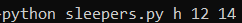

# Fantasy Football Python Information Tools

Fantasy Football Analysis Tools to help make informed draft and trade decisions


## Authors

- [@WheyGood (Matt S)](https://www.https://github.com/WheyGood)

## Appendix

- [Sleeper Finder](#fantasyPros-live-scrape-sleeper-finder)
- [VOR Values Downloader](#fantasyPros-normalized-vOR-downloader)

## Tech Stack

Language: Python 3.9.4

Packages:

- Pandas 1.2.5

- BeautifulSoup 4.11.1

---

## FantasyPros Live Scrape Sleeper Finder

Value over replacement based sleeper ranking program.  Print sleepers to screen to determine 
who may be a value pick during your drafts!  Make sure to run near draft day for best results.


### Calculations
Sleepers are determined by subtracting VOR rank values by ADP rank values

VOR is determined by finding the projected fantasy point totals for each position at around
pick 100 and then subtracted from each players projected total fantasy points.  

Sleepers are sorted based on greatest difference between average draft position and their
value over replacement rank.


### Deployment

This program requires three command line arguments.  

First, determine the style of league you
play in, basically how many points you get per catch.  The first command line argument will simply
be a single letter.  If you play in a standard league where catches have no extra value then 
type in 's', for a half point per reception league use 'h', and for a full point per reception
league use 'p'   

The second argument is the number of members in your league.

The final argument is the total number of players in your starting lineup and on the bench.
Typically, 13 or 14 is a normal for this value. 

 ```
 python sleepers.py s 10 13
 ```


### Output Example



---

## FantasyPros Normalized VOR Downloader

Download value over replacement numbers based on current FantasyPros projections and
ADP rankings to CSV.  Value over replacement drafting can be very efffective in making quick
comparative decisions during your draft.

### Deployment

This program requires two command line arguments.

The first command line argument is for your league type.
- 's' for standard leagues
- 'h' for half point ppr leagues
- 'p' dor full point ppr leagues

The second command line argument is if you want to downlaod the VOR values to CSV.
- 'y' if you want to create a CSV file
- 'n' if you only want to print the values to the screen

```
python vorvalues.py h y
```

### Output


